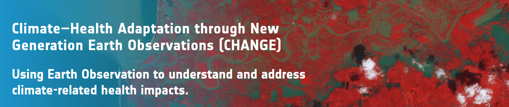

# Impact of flooding on health care services in South Sudan (GMV)

South Sudan is one of the most climate-vulnerable countries globally, where recurrent and intensifying flooding events are severely impacting both populations and an already fragile healthcare system. In recent years, large-scale floods have displaced over 1.4 million people and caused widespread disruption to healthcare services, including facility closures, restricted access, treatment interruptions, and increased transmission of water- and sanitation-related diseases.
In this context, this use case focuses on analysing the impact of flooding on healthcare service delivery and infrastructure, with particular attention to health facility functionality and accessibility. The objective is to develop a quantitative understanding of how flood dynamics translate into health system disruptions, and to assess the extent to which these impacts are influenced by climate variability and change.
The analysis adopts a risk-based framework, where flooding is treated as the primary hazard interacting with exposure (health infrastructure and populations) and vulnerability (health system capacity, accessibility constraints, and socio-economic conditions). Within this framework, the study characterises how flooding events—varying in intensity, duration, and spatial extent—affect healthcare services across the country.

## Description

The approach is centred on the integration of EO data with health infrastructure information to characterise flood dynamics and their impacts. EO-derived datasets (e.g., VIIRS, SWOT, CCI Land Cover, and digital elevation models) are used to derive long-term indicators of flood extent, frequency, duration, and water surface elevation, which are combined with health facility inventories (e.g., WHO Master Facility List) to assess exposure.
Flood dynamics are analysed over more than a decade (2012–2025), enabling the identification of long-term trends. Preliminary results indicate a significant increase in both the spatial extent and intensity of flooding, with more extreme and prolonged events observed in recent years, further increasing pressure on an already fragile health system.
At the facility level, the analysis evaluates how different types of healthcare facilities respond to flooding conditions, linking hazard and exposure indicators with vulnerability assumptions to estimate disruptions in service delivery. This enables the quantification of key impacts such as loss of service capacity and reduced accessibility of healthcare services.
To improve robustness and account for data limitations, the methodology incorporates stochastic modelling approaches, allowing the exploration of extreme but plausible flood scenarios and supporting a more comprehensive assessment of risk.
Overall, this use case connects flood behaviour with its effects on healthcare services, helping to better understand how climate-related hazards translate into health system disruptions.

For more information about this project, please refer to: https://climate.esa.int/supporting-the-paris-agreement/CHANGE/

## Getting Started

### Dependencies

This project requires Python 3.10+ and uses scientific, geospatial, and Bayesian libraries.

Main dependencies are listed in requirements.txt.
Optional accelerated dependencies (jax/numpyro/blackjax) are listed in requirements-gpu.txt.

For Linux geospatial installs, system libraries may be required (GDAL, PROJ, GEOS).

### Installing

1) Create and activate a clean Python environment (Python 3.10+ recommended), then install dependencies:

```
python -m venv .venv
source .venv/bin/activate
python -m pip install --upgrade pip
```

2) Install core dependencies:

```
pip install -r requirements.txt
```

3) (Optional) Install GPU/accelearted sampling dependencies:

```
pip install -r requirements-gpu.txt
```

4) (Optional) Register kernel for notebooks

```
python -m ipykernel install --user --name cci-health-floods --display_name ""CCI Health Floods"
```

Note: GPU-enabled jaxlib installation depends on your CUDA version. Follow the official JAX installation selector for the exact wheel.

### Executing program

This project is divided in differnt modules. You will find guidence on how to execute it inside ```./src``` folder.


## Authors

Contributors names and contact info

Macarena Mérida Floriano
mmef@gmv.com


