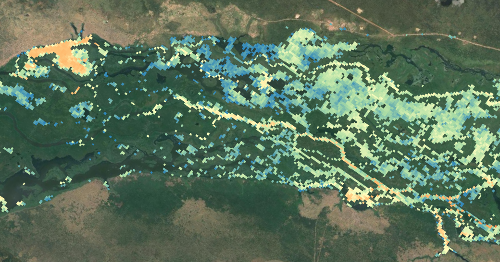
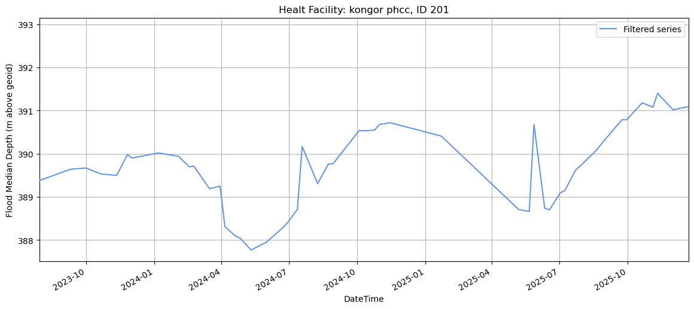

## SWOT Mission Flood Data Analysis

This folder contains the scripts developed to analyze SWOT flood data for the health facilities provided by the WHO. This analysis aims to complement the flood information derived from VIIRS.

### SWOT Mission

The Surface Water and Ocean Topography (SWOT) is a satellite altimeter jointly developed and operated by NASA (USA) and CNES (France) space agencies.

Through the KaRIn instrument and using SAR interferometry SWOT can measure water surface elevations (WSE) with centimetre-level vertical accuracy across a 120 km wide swath, obtaining measurements at high spatial resolutions ranging from 10 to 50 m.

### Why including SWOT data into the study?

The use of multi-sensor data for flood detection in South Sudan contributes to building a more comprehensive and meaningful flood event dataset. It also helps mitigate biases and limitations associated with VIIRS-based flood detection. The main advantages of using SWOT data are the improved spatial resolution to 100 meters and the inclusion of water elevation information. In contrast, the main limitations are the relatively low temporal resolution—despite its 21-day orbit cycle, SWOT provides an approximate 10-day revisit over the AOI—and the restricted observation period, spanning from July 2023 to December 2025.

### Input Data

This study used data from the *Level-2 KaRIn High Rate Raster Product* ([L2_HR_Raster Version D](https://podaac.jpl.nasa.gov/dataset/SWOT_L2_HR_Raster_250m_D)), provided at 100 m spatial resolution and distributed in 64 km × 64 km tiles. This product is derived from the *Level-2 High-Rate Pixel Cloud product* following several processing steps, including conversion to a continuous raster grid, quality filtering, geometric and radiometric corrections, and removal of invalid observations.

A total number of **864 SWOT frames** from both ascending and descending orbits were used for the period from **July 2023 to December 2025**, with an average revisit time of approximately 10 days over the AOI. When multiple versions of the same frame were available, only the most recent PGD0 product was selected according to official recommendations.

### Workflow - steps performed :bar_chart:

The analysis performed can be replicated using the conda environment provided by the YAML file and [this](https://zenodo.org/records/20622861) Zenodo dataset.

#### A) **Quality filtering**: with the following steps.

* Only good and suspect WSE pixels were retained based on the *wse\_qual* flag (0–1).
* A double‑check of WSE quality—although likely already addressed in the *wse\_qual* flag—was performed by removing pixels flagged as “value\_bad,” “geolocation\_qual\_degraded,” or “classification\_qual\_degraded” using the WSE bitwise flags.
* Pixels with high ​**layover**​-related systematic WSE errors—above the 95th percentile, based on absolute values—were removed to avoid large geolocation errors.
* A **cross-track distance** filter was applied to retain data exclusively within the 10–60 km range for both the left and right swaths.
* Pixels with a **dark water fraction**greater than 0.2 were removed. While these pixels can be valuable for flood extent mapping, they were excluded from the flood depth calculations to avoid introducing bias.
* To ensure that only pixels with significant water presence are retained, pixels with a **water fraction** (​*water\_frac*​) lower than 0.15 were removed.

#### B) Flood Descriptors Extraction: at health facility level using square buffers. The following flood statistics were calculated:

1. **Flood fraction.** Number of pixels flooded respect the total one within the buffer
2. ​**Mean depth**​. Water surface elevation average among the identified flooded pixels. Expressed in meters above geoid EGM2008.
3. ​**Median depth**​. Water surface elevation median value among the identified flooded pixels. Expressed in meters above geoid EGM2008. The median WSE is **used because** it is less sensitive to extreme erroneous values.
4. ​**Maximum Depth**​: The maximum water surface elevation value, defined as the **95thpercentile** to exclude extreme erroneous values and outliers.
5. ​**Maximum Distance**​: The linear distance—in meters—from the health facility (patch center point) to the pixel containing the maximum water surface elevation value within the patch—identified as that of the 95th percentile.

The resulting flood descriptor records are organized into individual GeoJSON files per processed frame, all of which are publicly available as a [Zenodo dataset](https://doi.org/10.5281/zenodo.20622861), also delivered in `data` folder.

#### C) **Time Series Processing:**

All individual health facility registers of SWOT-based flood descriptors were compiled into a single database to generate time series grouped by health facility and flood descriptor. Three main steps includes this section:

* **Outliers removal** using z-score greater than 2.5 according to the **median**​**flood depth** descriptor.
* Time-series values were converted into **anomalies** relative to the minimum value of each series for all flood-depth-related descriptors. Consequently, the reference datum shifts from the EGM2008 geoid to zero.
* A fixed threshold of 10 m for the median flood depth oscillation range was adopted to prevent the inclusion of time series with non-plausible variations in the stochastic model. Health facilities exceeding this value were excluded (7% of the total)."

### Scripts

:arrow_forward: **01_Download_SWOT_data**   Used to download all available SWOT mission frames across the Area of Interest (AOI).

:arrow_forward: **02_HF_metadata_and_series**   Generates VIIRS‑derived files containing time series and health‑facility metadata used later in the study.

:arrow_forward: **03_SWOT-testing**   Notebook developed for practicing and testing all functions and classes created for the analysis.

:arrow_forward: **04_Multiprocessing**   Script designed to automatically process every SWOT frame once the quality‑control filtering has been applied.

:arrow_forward: **05_Results_Analysis**   Notebook for interpreting and analyzing results. It allows the creation of the final database with SWOT‑derived flood descriptors to be used in the stochastic model.

:arrow_forward: **SWOT.py**   Script containing the core functions and classes used throughout the analysis.

### Acknowledgements

The author would like to thank both NASA and CNES space agencies for their support in verifying the treatment and processing of SWOT data. Special thanks go to Sylvain Biancamaria for his dedicated attention and valuable guidance throughout our email exchanges.

### Author

Contributors names and contact info

Miguel González Jiménez
mgonzalez.j@gmv.com

